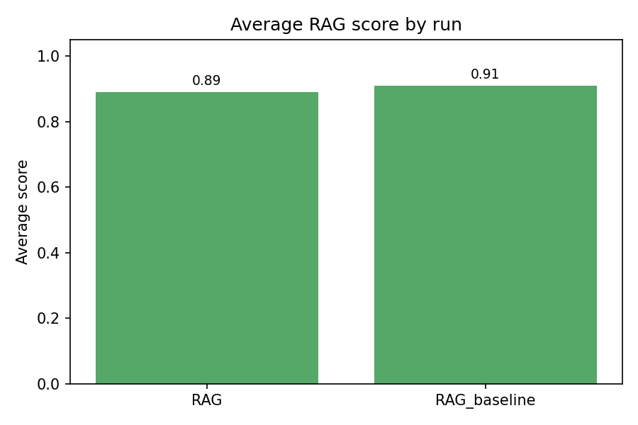
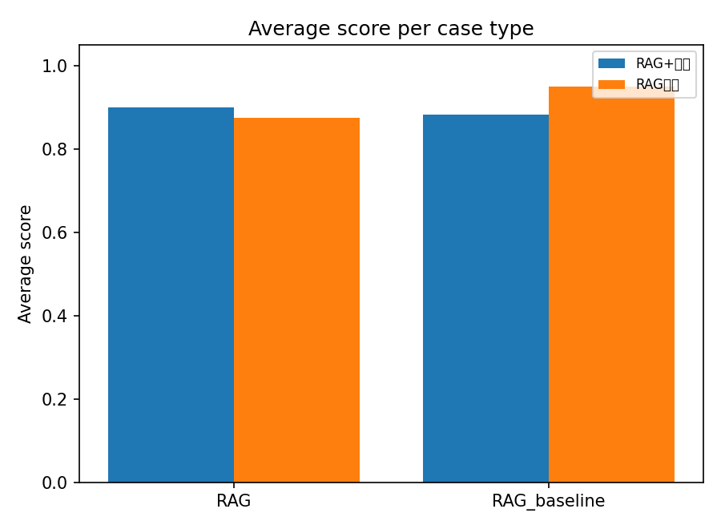
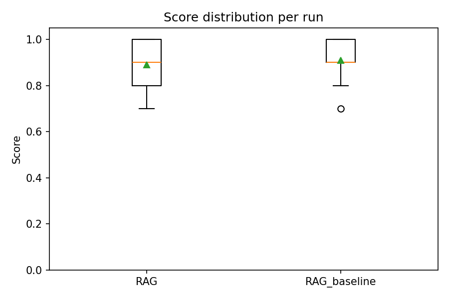

# RAG Evaluation Analysis

_Generated 2025-12-03 14:01:25_

## Run overview

| Run | Cases | Avg Score | Median | Avg Time (s) | Case type coverage |
| --- | --- | --- | --- | --- | --- |
| RAG | 10 | 0.89 | 0.90 | 18.1 | RAG+计算: 0.90 (6 cases), RAG测试: 0.88 (4 cases) |
| RAG_baseline | 10 | 0.91 | 0.90 | 10.9 | RAG+计算: 0.88 (6 cases), RAG测试: 0.95 (4 cases) |

## Highlights

- **Highest average score**: `RAG_baseline` (0.91).
- **Fastest responses**: `RAG_baseline` average 10.9s.
- **Slowest responses**: `RAG` average 18.1s.

## Average scores

## Case type averages

## Score distribution

## Lowest scoring prompts

| Run | Case ID | Type | Score | Summary |
| --- | --- | --- | --- | --- |
| RAG | 003 | RAG测试 | 0.70 | 回答基本涵盖了评估要点，对卷积核、特征图的概念进行了通俗解释，并说明了编码器-解码器结构在分割中的作用，如特征提取与分辨率恢复。但存在明显不足：未明确提及“下采 |
| RAG_baseline | 007 | RAG+计算 | 0.70 | 评分: 0.7   |
| RAG | 004 | RAG测试 | 0.80 | Agent 的回答在核心差异（预训练目标、输入输出形式）上准确区分了 BERT 和 GPT，并正确引用了知识库中的参考资料，信息基本可靠。优点包括明确指出了 B |
| RAG | 008 | RAG+计算 | 0.80 | Agent的回答在计算和公式呈现上准确无误，正确给出了折扣回报G₀的公式并计算出结果5.23，符合评估要点。对于折扣因子γ的影响分析，Agent能够区分γ接近1 |
| RAG | 009 | RAG+计算 | 0.80 | Agent 的回答在计算部分准确，正确给出了原始和降维后的运算量及下降比例，并简要提及了降维的影响。然而，回答未能完整满足评估要点1，即未明确说明预测阶段时间复 |
