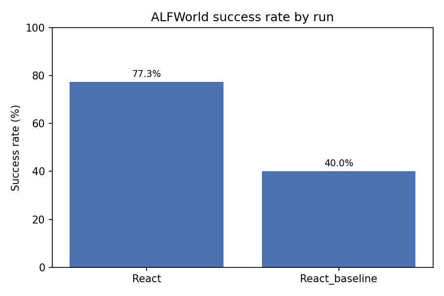
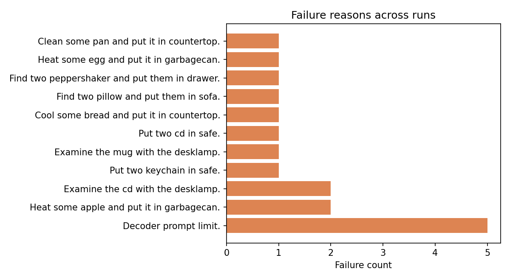

# React / ALFWorld Benchmark Analysis

_Generated 2025-12-03 14:01:00_

## Run overview

| Run | Total Games | Success Rate | Avg Steps | Avg Successful Steps | Avg Action Accuracy | Failures |
| --- | --- | --- | --- | --- | --- | --- |
| React | 22 | 77.27% | 17.95 | 15.55 | 83.03% | 5 |
| React_baseline | 20 | 40.00% | 27.10 | 12.50 | 63.00% | 12 |

## Highlights

- **Best run**: `React` with 77.3% success rate.
- **Most reliable actions**: `React` averaging 83.03% action accuracy.
- **Needs attention**: `React_baseline` success rate 40.0%.

## Success rate comparison

## Failure reasons

### Breakdown

| Reason | Count |
| --- | --- |
| Decoder prompt limit. | 5 |
| Heat some apple and put it in garbagecan. | 2 |
| Examine the cd with the desklamp. | 2 |
| Put two keychain in safe. | 1 |
| Examine the mug with the desklamp. | 1 |
| Put two cd in safe. | 1 |
| Cool some bread and put it in countertop. | 1 |
| Find two pillow and put them in sofa. | 1 |
| Find two peppershaker and put them in drawer. | 1 |
| Heat some egg and put it in garbagecan. | 1 |
| Clean some pan and put it in countertop. | 1 |
