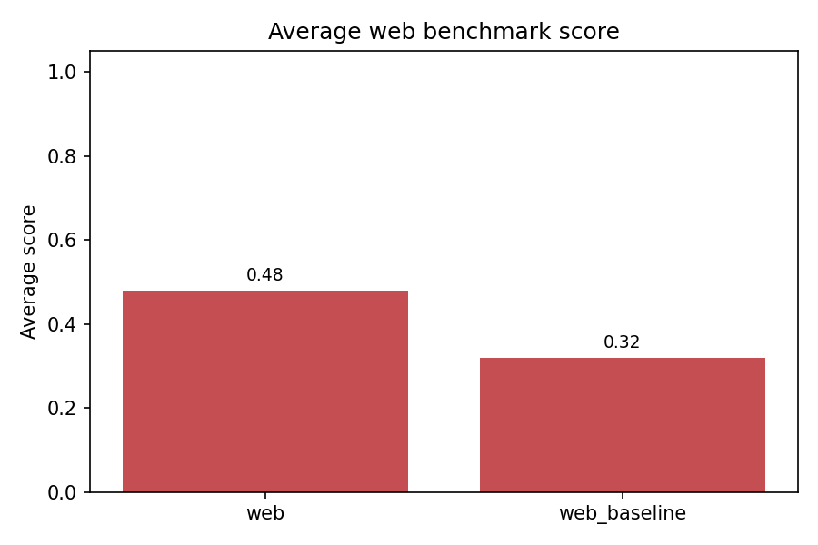
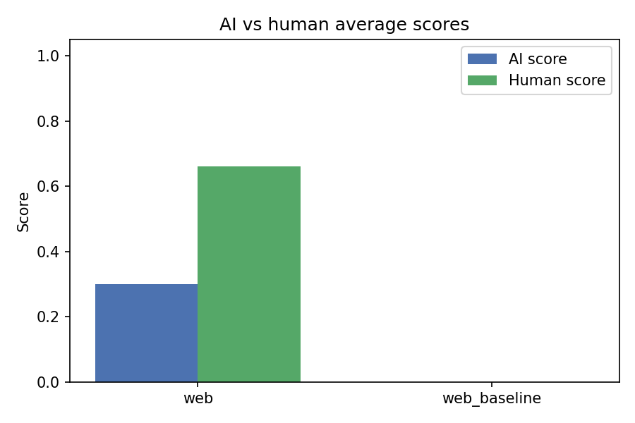
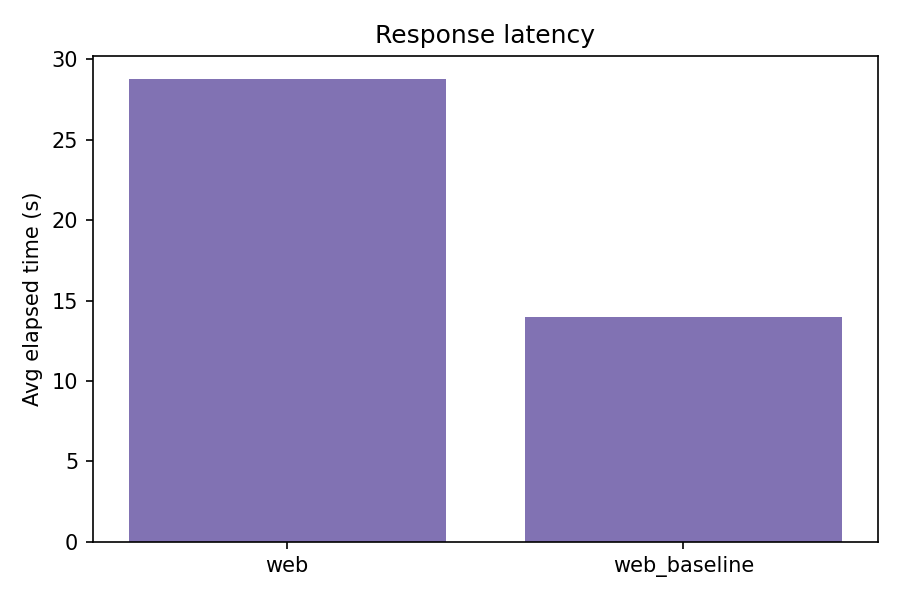

# Web Benchmark Analysis

_Generated 2025-12-03 14:02:38_

## Run overview

| Run | Cases | Avg score | Avg AI score | Avg human score | Avg time (s) |
| --- | --- | --- | --- | --- | --- |
| web | 10 | 0.48 | 0.30 | 0.66 | 28.8 |
| web_baseline | 10 | 0.32 | n/a | n/a | 14.0 |

## Highlights

- **Highest average score**: `web` at 0.48.
- **Most consistent**: `web_baseline` had the lowest score variance.
- **Needs attention**: `web_baseline` average 0.32.

## Average scores

## AI vs human

## Latency

## Frequent failure reasons (score < 0.7)

| Reason | Count |
| --- | --- |
| 评分: 0.3 | 7 |
| AI评分(0.4): Agent 正确理解了任务的核心需求，即设计预算约10000元的台式电脑配置清单，并覆盖了所有8个核心部件。其流程中的“Thought”部分表明它意识到了需要 | 1 |
| AI评分(0.3): Agent 的流程执行存在严重缺陷。其核心问题是未能正确理解并执行“基于实时搜索”的任务要求。它仅对单一、特定的历史文章链接（发布于2025年11月28日）执 | 1 |
| AI评分(0.2): Agent的流程执行存在根本性错误。它未能正确理解并执行用户指定的任务。其“思考”环节表明它进行了搜索，但搜索内容与任务要求（对比京东、天猫、拼多多三大平台i | 1 |
| AI评分(0.4): Agent 正确理解了任务类型为在线搜索，并识别了数据来源应为官方渠道。然而，在执行流程上存在严重缺陷。其“思考”过程显示工具配置异常导致搜索失败，但并未展示 | 1 |
| AI评分(0.2): Agent未能正确执行在线搜索任务的流程。其核心问题在于完全放弃了使用搜索工具进行信息查询和整合的步骤，仅以“无法访问”为由直接提供了通用官网链接，并要求用户 | 1 |
| AI评分(0.3): Agent 未能正确执行任务流程。任务明确要求通过在线搜索工具查询并列出具体的漏洞信息，但 Agent 的思考过程表明其依赖“现有工具返回的结果”并直接得出结 | 1 |
| AI评分(0.2): Agent 的流程执行存在根本性缺陷。其核心问题在于未能正确理解并执行任务所要求的搜索方法。任务明确要求“从 NeurIPS 2025 官方网站和各 Work | 1 |
| AI评分(0.3): Agent 未能正确执行在线搜索任务的核心流程。其“Thought”部分承认因工具限制和网络问题无法获取官方文档，这表明其搜索方法存在根本性缺陷或未有效使用工 | 1 |
| AI评分(0.4): Agent 正确理解了任务的核心要求（查询特定时间内的家电召回通告）并使用了搜索工具，这表明其流程的起点是正确的。然而，其执行流程存在重大缺陷。Agent 未 | 1 |
| AI评分(0.3): Agent 的流程执行存在严重缺陷。它正确理解了任务的核心约束（时间、地点、活动类型），并提及了应优先使用的信息来源。然而，其执行流程不完整。关键问题在于，A | 1 |
| 评分: 0.2 | 1 |
| 评分: 0.5 | 1 |
| 评分: 0.4 | 1 |
